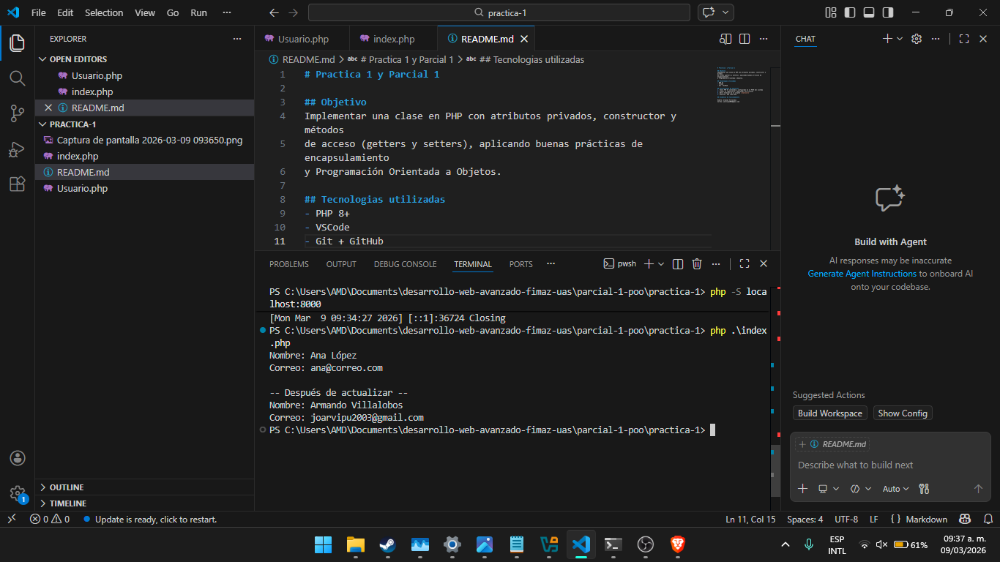
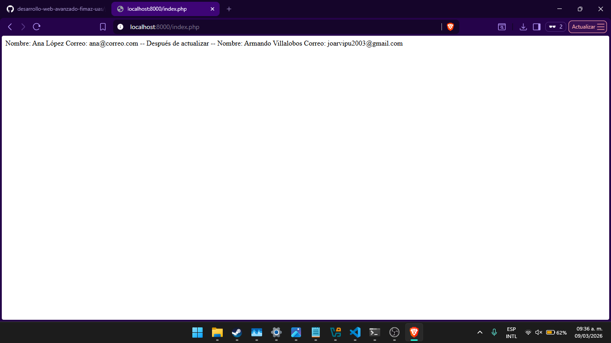

# Practica 1 y Parcial 1

## Objetivo
Implementar una clase en PHP con atributos privados, constructor y métodos
de acceso (getters y setters), aplicando buenas prácticas de encapsulamiento
y Programación Orientada a Objetos.

## Tecnologias utilizadas
- PHP 8+
- VSCode
- Git + GitHub

## Instrucciones de ejecucion
1. Tener PHP 8+ instalado y configurado en el PATH del sistema
2. Clonar el repositorio o descargar los archivos
3. Abrir terminal en la carpeta `practica-1`
4. Ejecutar: php index.php

## Evidencia de funcionamiento

Nombre: Armando Villalobos  
Correo: joarvipu2003@gmail.com

