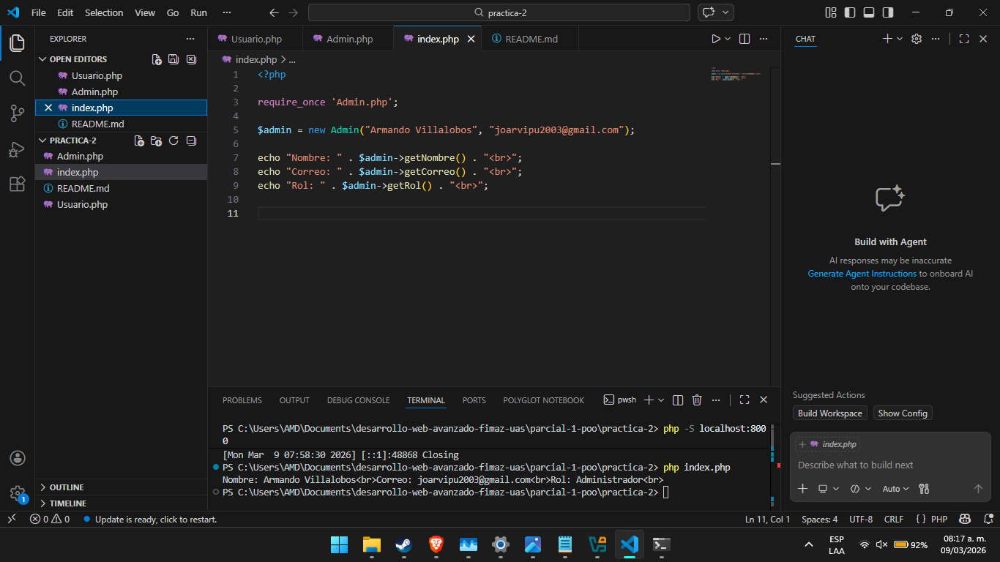

# Practica 2 - Parcial 1

## Objetivo
Implementar herencia en PHP mediante la extensión de clases,
reutilizando atributos y métodos de una clase base (Usuario)
en una clase hija (Admin).

## Tecnologias utilizadas
- PHP 8+

## Instrucciones de ejecucion
1. Clonar el repositorio
2. Navegar a la carpeta `parcial-1-poo/practica-2`
3. Ejecutar en terminal o navegador: `php index.php`

## Evidencia de funcionamiento
Al ejecutar `php index.php` en la terminal se obtiene:

Nombre: Armando Villalobos  
Correo: joarvipu2003@gmail.com
Rol: Administrador

.png)