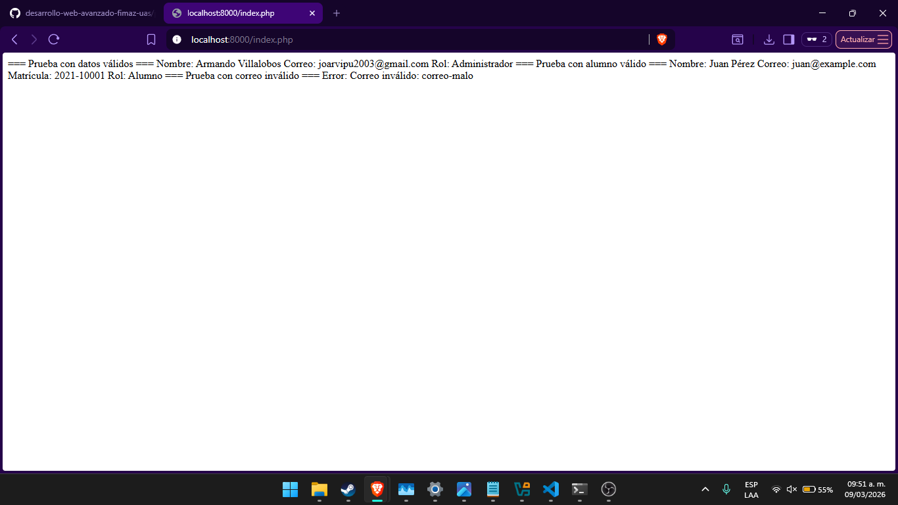

# Practica 3 - Parcial 1

## Objetivo
Desarrollar un sistema orientado a objetos con herencia,
validaciones y manejo de excepciones en PHP.

## Tecnologias utilizadas
- PHP 8+

## Instrucciones de ejecucion
1. Clonar el repositorio
2. Navegar a la carpeta `parcial-1-poo/practica-3`
3. Ejecutar en terminal: `php index.php`

## Evidencia de funcionamiento

