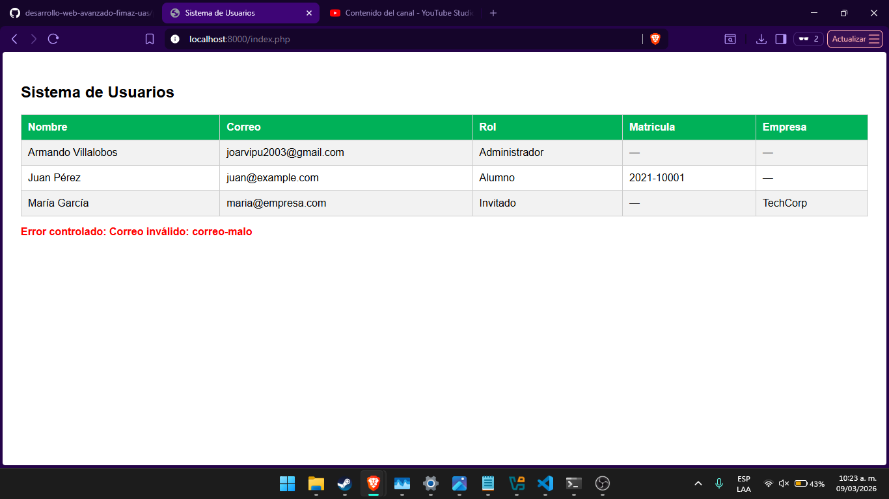

# Practica 4 - Parcial 1

## Objetivo
Construir un mini-sistema POO en PHP integrando herencia,
validaciones, excepciones y salida en tabla HTML.

## Tecnolog�as utilizadas
- PHP 8+

## Instrucciones de ejecuci�n
1. Clonar el repositorio
2. Navegar a la carpeta `parcial-1-poo/practica-4`
3. Ejecutar: `php -S localhost:8000`
4. Abrir en navegador: `http://localhost:8000/index.php`

## Evidencia de funcionamiento

https://youtu.be/cR1PMjS8W3A